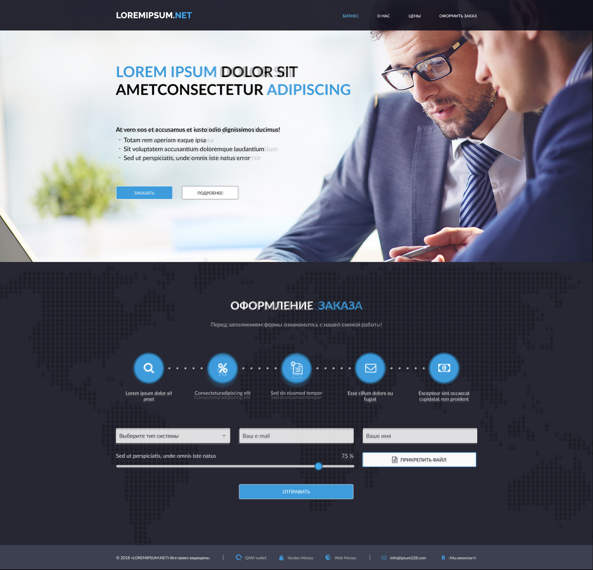
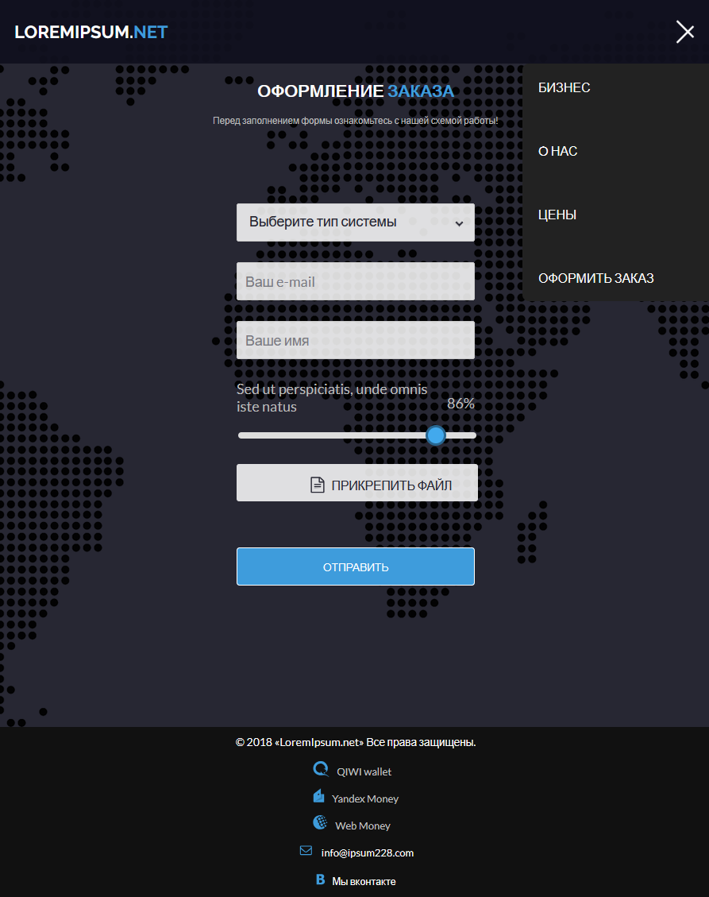

# проект

Требования к заданию:

1. Вёрстка должна быть адаптивной с минимальным разрешением для отображения
   320px. Адаптив делается на Ваше усмотрение, однако при любом разрешении
   страница должна корректно отображаться в браузере.
2. Вёрстка с соблюдением структуры и нейминга в соответствии с методологией БЭМ.
3. Для стилей используется препроцессор SASS в диалекте SCSS.
4. Готовая вёрстка должна корректно отображаться на последних версиях всех
   актуальных браузеров (Chrome, Firefox, Edge (chromium), Safari), а также их
   мобильных аналогах.
5. Готовая страница, а также все ресурсы должны быть оптимизированы по "весу" и
   размеру.
6. Текст, количество пунктов в оформлении заказа, количество полей форм могут
   меняться - вёрстка должна это предусматривать.
7. В футере платежные системы - не ссылки, а контакты – ссылки.
8. Форма должна быть подготовленной к работе (каждое поле должно быть
   input[name='....']).
9. Шапка (header) должна прилипать к верху страницы при скролле.
10. Не допускается использование html/css-фреймоворков или сеток по типу bootstrap
    и др.
11. Приветствуется инициативность в создании динамики на странице (анимации,
    hover).
12. Допускается использование сторонних плагинов для стилизации элементов, если
    это необходимо.
13. Выполненное тестовое задание должно быть загружено на github со страницей на
    github pages.

---

### Perfect Pixel

### Мобильный макет не был предоставлен, поэтому была сделана минимальная верстка.

---

## Используемые технологии

- React
- TypeScript
- Nextjs
